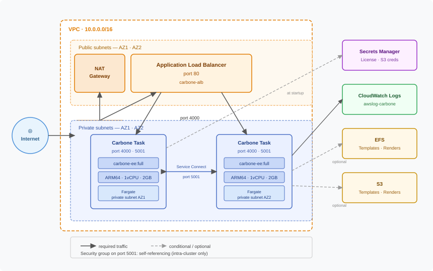

# Carbone deployment on Amazon Elastic Container Service

This Terraform configuration deploys [Carbone EE](https://carbone.io) on AWS ECS Fargate behind an Application Load Balancer, with optional EFS or S3 storage for templates and renders.

## Prerequisites

- [Terraform](https://developer.hashicorp.com/terraform/install) >= 1.0
- [AWS CLI](https://docs.aws.amazon.com/cli/latest/userguide/getting-started-install.html) configured with a profile named `ecs`
- A valid Carbone EE license key

## First deployment

**1. Store the license in Secrets Manager**

```bash
aws secretsmanager create-secret \
  --name carbone-ee/license \
  --secret-string "<your-license-key>" \
  --profile ecs
```

**2. Configure your deployment**

Edit `terraform.tfvars` to match your environment. See the [Configuration](#configuration) section for all available options.

**3. Deploy**

```bash
terraform init
terraform apply
```

The service URL is printed at the end of the apply.

## Architecture



> Port 5001 is restricted to intra-cluster traffic only via a self-referencing security group rule.

## Configuration

Options can be set in a `terraform.tfvars` file or passed via `-var` flags.

### General

| Variable | Type | Default | Description |
|---|---|---|---|
| `region` | `string` | `"us-east-1"` | AWS region to deploy into |
| `studio` | `bool` | `true` | Enable the Carbone Studio web interface |
| `template_management` | `bool` | `false` | Enable the Template Management API |
| `debug` | `bool` | `false` | Enable ECS Exec to open a shell into running containers |

### Storage

| Variable | Type | Default | Description |
|---|---|---|---|
| `template_storage` | `bool` | `true` | Persist templates on shared storage |
| `render_storage` | `bool` | `false` | Persist rendered files on shared storage |
| `efs_storage` | `bool` | `true` | Use EFS for persistent storage |
| `s3_storage` | `bool` | `false` | Use S3 for persistent storage |

### Storage modes

`efs_storage` and `s3_storage` are mutually exclusive. `template_storage` and `render_storage` control which directories are persisted, independently of the storage backend.

| `efs_storage` | `s3_storage` | `template_storage` | `render_storage` | Result |
|:---:|:---:|:---:|:---:|---|
| `true` | `false` | `true` | `false` | Templates persisted on EFS |
| `true` | `false` | `true` | `true` | Templates + renders persisted on EFS |
| `false` | `true` | `true` | `false` | Templates persisted on S3 |
| `false` | `true` | `true` | `true` | Templates + renders persisted on S3 |
| `false` | `false` | — | — | No persistent storage |

### Example `terraform.tfvars`

```hcl
region           = "eu-west-3"
template_storage = true
render_storage   = false
efs_storage      = true
s3_storage       = false
```

## Production best practices

**Remote state** — Store the Terraform state in S3 with a DynamoDB lock table to enable team collaboration and prevent concurrent applies:

```hcl
terraform {
  backend "s3" {
    bucket         = "my-terraform-state"
    key            = "carbone/ecs/terraform.tfstate"
    region         = "eu-west-3"
    dynamodb_table = "terraform-locks"
    encrypt        = true
  }
}
```

**HTTPS** — Add an HTTPS listener on the ALB with an ACM certificate and redirect HTTP to HTTPS. Never expose port 80 in production.

**IAM permissions** — The `secretsmanager:GetSecretValue` policy currently allows `Resource: "*"`. Restrict it to the exact ARN of the Carbone license secret.

**Disable Studio** — If the Studio interface is not needed in production, set `studio = false` to reduce the attack surface.

**Disable debug** — Keep `debug = false` in production. ECS Exec opens a shell into running containers and should only be enabled for troubleshooting.

**Image version** — Pin the container image to a specific version instead of `full` to ensure reproducible deployments:

```hcl
image = "carbone/carbone-ee:4.x.x-full"
```

**Autoscaling thresholds** — The default CPU target is 40%. Adjust `max_capacity` and `target_value` based on your actual load profile to avoid under-provisioning.

## FAQ

### How to open a shell into a running task?

Enable debug mode (`debug = true`) then apply. Once deployed, retrieve the task ID from the ECS console or CLI and run:

```bash
# List running tasks
aws ecs list-tasks --cluster CarboneCluster --profile ecs

# Open a shell
aws ecs execute-command \
  --cluster CarboneCluster \
  --task <task-id> \
  --container Carbone \
  --interactive \
  --command "/bin/bash" \
  --profile ecs
```

> Disable `debug` and redeploy once troubleshooting is done.

### How to check the service logs?

Logs are sent to CloudWatch under the log group `awslog-carbone`. View them with:

```bash
aws logs tail awslog-carbone --follow --profile ecs
```

### How to retrieve the service URL after deployment?

The URL is printed at the end of `terraform apply`. To retrieve it later:

```bash
terraform output service_url
```

### How to scale the service manually?

```bash
aws ecs update-service \
  --cluster CarboneCluster \
  --service carbone \
  --desired-count 3 \
  --profile ecs
```

Note that autoscaling will override this value once active. To change the baseline permanently, update `desired_count` in `ecs.tf` and run `terraform apply`.

### How to update the Carbone license?

Update the secret value in Secrets Manager then force a new deployment so the tasks restart and pick up the new value:

```bash
aws secretsmanager put-secret-value \
  --secret-id carbone-ee/license \
  --secret-string "<new-license>" \
  --profile ecs

aws ecs update-service \
  --cluster CarboneCluster \
  --service carbone \
  --force-new-deployment \
  --profile ecs
```
